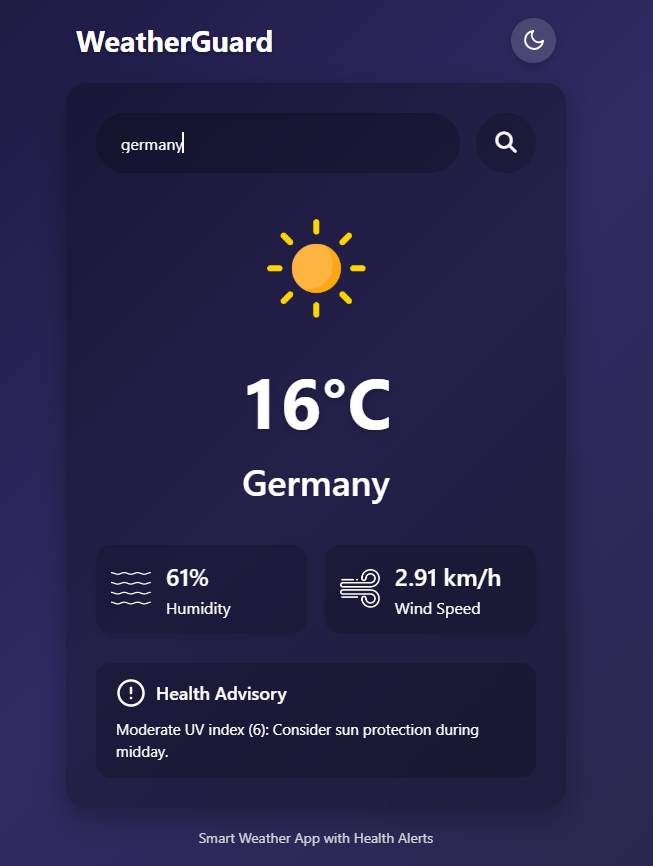

# 🌤 Weather App - Frontend

A simple weather app built using HTML, **CSS, and **JavaScript that fetches real-time weather data using a public Weather API.  
This app allows users to search weather by city name and displays temperature, weather conditions, and icons.

## 🔍 Features

- 🌐 Get real-time weather for any city
- 🔎 Search box for entering city name
- 🌡 Shows temperature in Celsius
- 🌥 Displays weather conditions (cloudy, rainy, etc.)
- 📱 Responsive design for mobile and desktop
- 📦 Uses open Weather API (e.g., OpenWeatherMap)

## 📸 Screenshots

